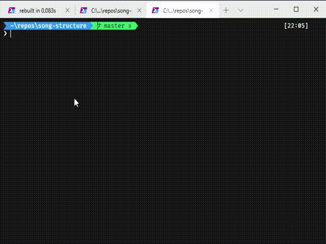

# song-structure [](https://npmjs.org/package/song-structure)   [](https://github.com/feross/standard)   

> Get rough idea on potential song structures from the CLI



## Structuring music can be hard, this aims to ease it a tiny bit
This isn't planned to be an active project, unless there is much interest in it then it probably won't ever be much more than it is.

Currently it simply prompts for the number of beats in the song, beats per measure, desired structure (Intro, Verse, Chorus, Verse...), then distributes those in a naive manner using a [Hare-Niemeyer](https://github.com/juliuste/hare-niemeyer) algorithm and pre-set proportions for each part type.

From there it will print (roughly) how many measures and beats each part should get. It doesn't elegantly deal with odd numbers of measures nor does it handle "draws" well.

That is, in some instances you'll see choruses with differing numbers of measures, which is pretty much never correct. Rather, what should happen is those should be re-apportioned to more flexible part types like the bridge or outro.

In regards to odd numbers, it is less common to have odd numbers of measures in verses and certainly in choruses, but this doesn't deal with those scenarios yet.

Pull requests are very welcome!

# Usage
```sh
# Install globally
$ npm install --global song-structure
```

```sh
song-structure # then follow the prompts
```

# License

MIT © [Andrew Carpenter](https://github.com/doesdev)
